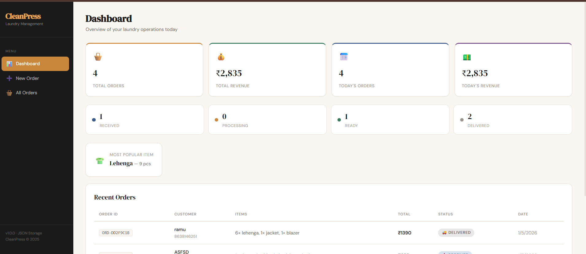
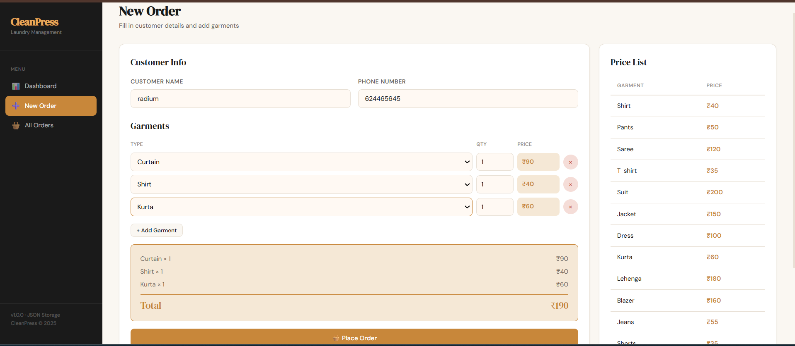
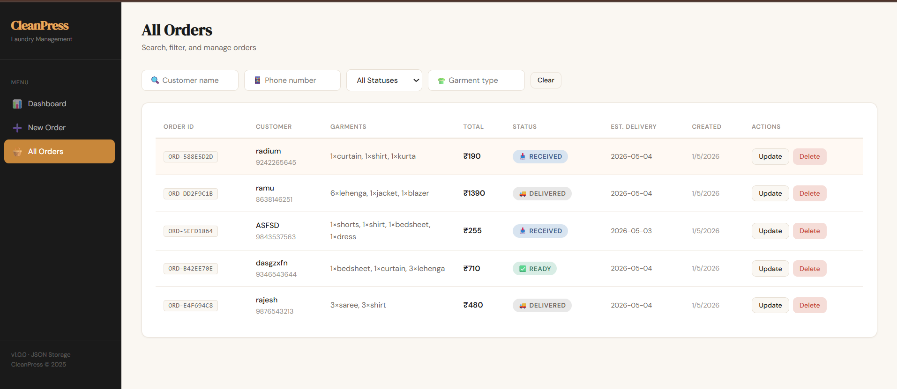
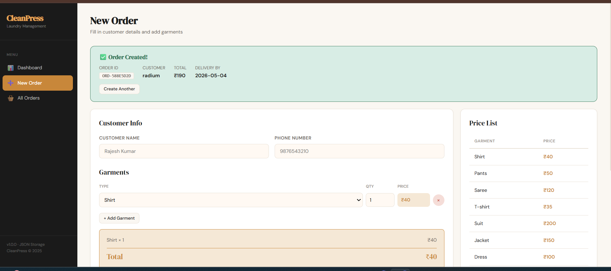
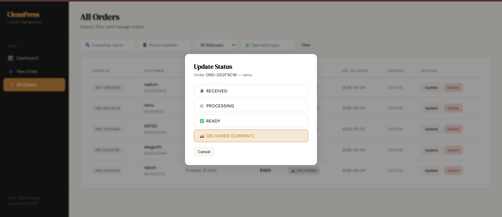

# 🧺 CleanPress — Mini Laundry Order Management System

A full-stack laundry order management system built with React (frontend) + Node.js/Express (backend) + JSON file storage.

---

## 🚀 Setup Instructions

### Prerequisites
- Node.js v18+
- npm

### 1. Backend Setup

```bash
cd backend
npm install
npm start
# Server runs on http://localhost:5000
```

For development with auto-reload:
```bash
npm run dev
```

### 2. Frontend Setup (separate terminal)

```bash
cd frontend
npm install
npm run dev
# App runs on http://localhost:5173
```

### 3. Production Build (serve frontend from backend)

```bash
cd frontend
npm run build
cd ../backend
npm start
# Visit http://localhost:5000
```

> **Data storage**: Orders are saved in `backend/data/orders.json`. This file auto-creates on first run.

---

## 📸 Screenshots

| Dashboard | New Order |
|---|---|
|  |  |

| All Orders | Order Created |
|---|---|
|  |  |

| Update Status |
|---|
|  |

## ✅ Features Implemented

### Core Features
| Feature | Status |
|---|---|
| Create Order (name, phone, garments, qty) | ✅ |
| Auto-calculate total bill | ✅ |
| Unique Order ID (ORD-XXXXXXXX) | ✅ |
| Order Status: RECEIVED → PROCESSING → READY → DELIVERED | ✅ |
| Update order status | ✅ |
| List all orders | ✅ |
| Filter by status | ✅ |
| Filter by customer name | ✅ |
| Filter by phone number | ✅ |
| Dashboard: total orders, revenue, orders per status | ✅ |

### Bonus Features
| Feature | Status |
|---|---|
| React frontend UI | ✅ |
| Estimated delivery date (based on garment type) | ✅ |
| Filter by garment type | ✅ |
| Delete order | ✅ |
| Today's orders & revenue | ✅ |
| Most popular garment tracking | ✅ |
| Input validation (phone, required fields) | ✅ |
| Persistent JSON storage | ✅ |

---

## 📡 API Reference

### Orders
| Method | Endpoint | Description |
|---|---|---|
| POST | `/api/orders` | Create new order |
| GET | `/api/orders` | List all orders (supports ?status=&name=&phone=&garmentType=) |
| GET | `/api/orders/:id` | Get single order |
| PATCH | `/api/orders/:id/status` | Update status |
| DELETE | `/api/orders/:id` | Delete order |
| GET | `/api/orders/prices` | Get garment price list |

### Dashboard
| Method | Endpoint | Description |
|---|---|---|
| GET | `/api/dashboard` | Get summary stats |

### Example: Create Order
```json
POST /api/orders
{
  "customerName": "Rajesh Kumar",
  "phone": "9876543210",
  "garments": [
    { "type": "shirt", "quantity": 3 },
    { "type": "saree", "quantity": 1 }
  ]
}
```

Response:
```json
{
  "success": true,
  "order": {
    "orderId": "ORD-A1B2C3D4",
    "customerName": "Rajesh Kumar",
    "phone": "9876543210",
    "garments": [...],
    "totalAmount": 240,
    "status": "RECEIVED",
    "estimatedDelivery": "2025-07-15",
    "createdAt": "2025-07-13T10:00:00.000Z"
  }
}
```

### Example: Update Status
```json
PATCH /api/orders/ORD-A1B2C3D4/status
{ "status": "PROCESSING" }
```

---

## 🤖 AI Usage Report

### Tools Used
- **Claude (Anthropic)** — primary tool for scaffolding, logic, and UI

### Sample Prompts Used
1. *"Build a Node.js Express REST API for laundry order management with JSON file storage. Include create order with bill calculation, status update, list with filters, and dashboard stats."*
2. *"Create a React frontend with sidebar navigation for Dashboard, Create Order, and Orders List pages. Use DM Serif Display + DM Sans fonts, warm cream/charcoal color palette."*
3. *"Add garment pricing logic and estimated delivery date calculation based on garment type complexity."*

### Where AI Helped
- Scaffolded the entire Express route structure in one shot
- Generated the CSS design system (variables, components) quickly
- Built the filter query logic for orders endpoint
- Created the dashboard aggregation logic

### What AI Got Wrong / What I Improved
- AI initially suggested MongoDB — switched to JSON file storage per requirements
- AI used `form` HTML tags in React — replaced with `div` + onClick handlers (React best practice)
- AI generated overly complex state management — simplified to minimal useState hooks
- Phone validation regex was too loose — tightened to Indian 10-digit format `[6-9]\d{9}`
- Garment price lookup was case-sensitive — added `.toLowerCase().trim()` normalization

---

## ⚖️ Tradeoffs

### What I Skipped
- Authentication (JWT/sessions) — not needed for a store-internal tool at this scale
- Pagination for orders list — JSON store is small; all orders load fine
- Unit tests — time-boxed to 72 hours

### What I'd Improve with More Time
- Switch to SQLite or MongoDB for proper querying at scale
- Add JWT auth for multi-staff use
- Print/PDF bill generation per order
- SMS notification when order is READY (Twilio)
- Deploy to Render (backend) + Vercel (frontend)
- Add order edit functionality (currently only status update)

---

## 💰 Garment Price List

| Garment | Price |
|---|---|
| Shirt | ₹40 |
| T-Shirt | ₹35 |
| Pants | ₹50 |
| Jeans | ₹55 |
| Shorts | ₹35 |
| Kurta | ₹60 |
| Dress | ₹100 |
| Jacket | ₹150 |
| Blazer | ₹160 |
| Suit | ₹200 |
| Saree | ₹120 |
| Lehenga | ₹180 |
| Bedsheet | ₹80 |
| Curtain | ₹90 |
| Towel | ₹30 |

---

## 🏗️ Project Structure

```
laundry-system/
├── backend/
│   ├── data/
│   │   └── orders.json        # JSON database
│   ├── routes/
│   │   ├── orders.js          # Order CRUD routes
│   │   └── dashboard.js       # Dashboard stats
│   ├── utils/
│   │   ├── db.js              # JSON read/write helper
│   │   └── pricing.js         # Garment prices & delivery days
│   ├── server.js              # Express app entry
│   └── package.json
├── frontend/
│   ├── src/
│   │   ├── App.jsx            # All pages + components
│   │   ├── index.css          # Design system + styles
│   │   └── main.jsx           # React entry point
│   ├── index.html
│   ├── vite.config.js
│   └── package.json
└── README.md
```
